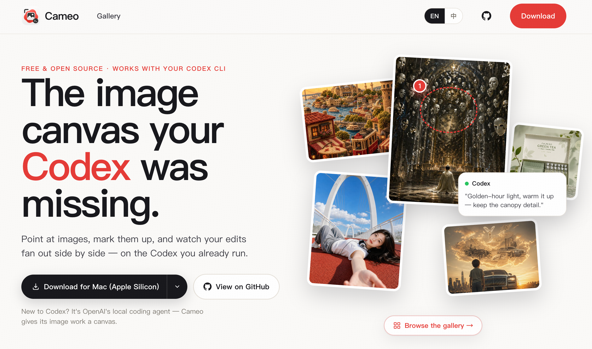
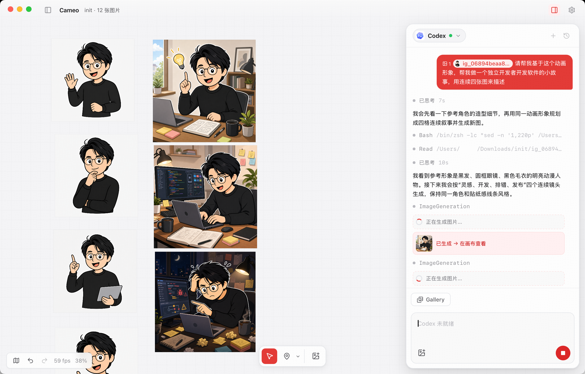
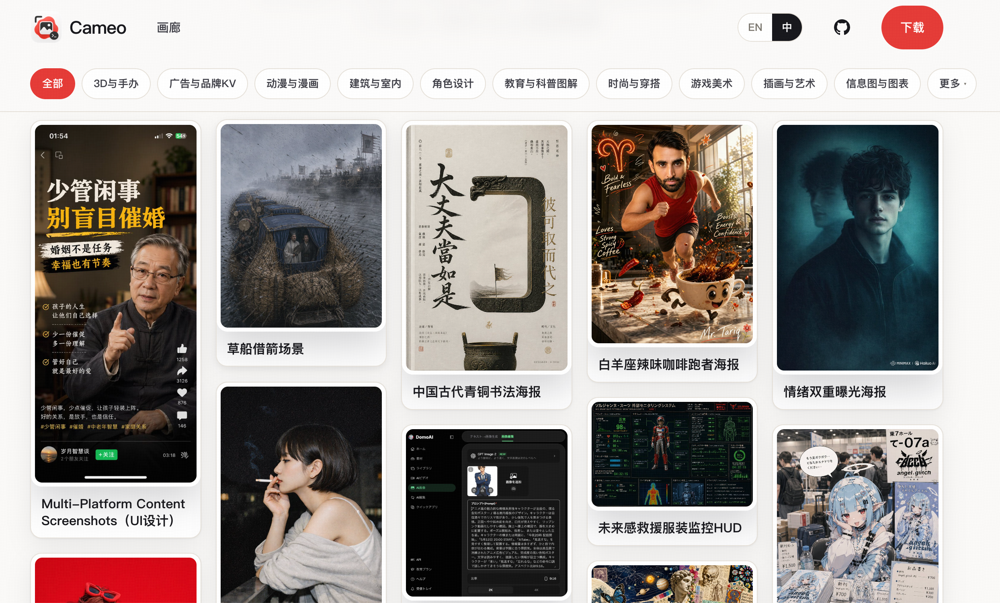

<p align="center">
  
</p>

<h1 align="center">Cameo</h1>

<p align="center">
  <b>An image-first canvas for your local Codex agent.</b><br/>
  Point at images, mark them up, and talk to Codex — generations and edits fan out across an infinite canvas.
</p>

<p align="center">
  <a href="https://cameo.ink"><b>cameo.ink</b></a> &nbsp;·&nbsp; <a href="#english">English</a> &nbsp;·&nbsp; <a href="#中文">中文</a> &nbsp;·&nbsp; <a href="./LICENSE">License (AGPL-3.0)</a>
</p>

<p align="center">
  <a href="https://cameo.ink"></a>
</p>

---

<a id="english"></a>

## What is Cameo?

**Cameo is a native desktop canvas that gives your local Codex agent hands and eyes for image work.**

Chat is a terrible interface for images. You can't point at the corner of a photo and say "this part." You can't see three variations side by side. You can't keep the original next to the edit. Codex can already generate and edit images — but a single scrolling chat column flattens all of that into a thread you lose track of.

Cameo puts that capability into a **spatial canvas** instead. You open a folder, its images lay out on an infinite board, and you work the way you actually think about images: select one, draw a box on the part you mean, type an instruction, and the result lands **right next to the source** so the lineage is visible. The conversation stays continuous — "warmer," "now change the background," "do that to these three" — because there's one ongoing Codex session per board.

Cameo is **the hands and eyes, not the brain.** It does not host a model, sell tokens, or orchestrate agents. All generation and understanding stay with Codex (using your existing ChatGPT subscription — no API key). Cameo owns only what a chat UI structurally can't: spatial layout, file identity, non-destructive lineage, and "what you're pointing at."

<p align="center">
  
</p>

## Key ideas

- **Board = folder.** A board maps 1:1 to a local folder, which is also the agent's working directory. Your files stay yours, on disk, in a format any other tool can read.
- **Non-destructive, always.** Originals are never overwritten. Every output is a new image with visible lineage — position (left → right) *is* the history.
- **Point, don't describe.** Mark a region and it's sent to the agent as an image overlay — runtime-agnostic, no structured-mask API required. Any model that can see an image can use it.
- **One continuous session per board.** Codex holds the conversation (it's stateful and can ask clarifying questions); Cameo mirrors the timeline. Not per-image one-shots.
- **Provide context, let the agent reason.** Cameo injects what you selected and gets out of the way. No workflow state machines re-implementing intent.

## Features

- Infinite **PixiJS / WebGL2 canvas** — pan, zoom, marquee-select, drag, resize, rotate, minimap, fit-all / zoom-to-selection.
- **Region marks** (rect / ellipse / arrow / brush / point) with per-mark notes, sent as an overlay image.
- **Presets** for one-tap operations (e.g. remove background, upscale) plus free-form instructions.
- **Compare** outputs with a before/after slider or 2-up view.
- **Crop, copy, reveal in file manager, export.**
- **Undo / redo**, **multiple sessions** per board with full timeline persistence, and a **workspaces** sidebar (recent boards, restore-last).
- **Continuous Codex session** with streaming responses, plan/tool visibility, and clarifying-question support.
- **Per-board generation controls** right in the input box — pick the model, intelligence (reasoning effort), and speed, mirroring the official Codex app.
- **Settings + network proxy** that covers *all* of Cameo's traffic (Codex, gallery, telemetry, updates — not just the agent), unified logging, and **i18n (English / 中文)**.
- Cross-platform: **Windows, macOS (Apple Silicon + Intel)**.

## How it works

Cameo is **Tauri 2 (Rust) + React + PixiJS v8**. The web layer owns chrome; a GPU compositor owns the canvas (Figma-style layering). Images are fed to the canvas through a custom Cameo image protocol with platform-specific Tauri URL shapes, path-normalization, and traversal guards; Rust handles decode / downscale / mipmaps off the main thread.

Codex runs as a long-lived **`codex app-server`** sidecar (JSON-RPC 2.0 over stdio) — one process per board, so the session is genuinely stateful. Marked regions are flattened to an overlay image and sent alongside the clean image as file paths the agent reads itself. Image outputs (`imageGeneration` items, whether a saved path or base64) are copied into the board folder, minted as new content-addressed assets, and placed to the right of the source.

## Gallery

A browsable gallery of prompts and results lives at **[cameo.ink/gallery](https://cameo.ink/gallery)** (also reachable from inside the app).

<p align="center">
  
</p>

## Quick start

> **Just want the app?** Download a prebuilt release from **[cameo.ink](https://cameo.ink)**. The steps below are for building from source.

Prerequisites (all platforms):

- **Codex CLI** installed and signed in: `codex login` (uses your ChatGPT subscription — no API key). Verify with `codex --version`. Cameo drives your own Codex — it is **not** bundled.
- Node 20+ and **pnpm**, plus the **Rust** toolchain (rustup) for Tauri 2.
- **macOS**: Xcode Command Line Tools (`xcode-select --install`).
- **Windows**: Visual Studio Build Tools with the *Desktop development with C++* workload, and the WebView2 runtime (preinstalled on Windows 11).

One-time setup (checks toolchain, adds Rust targets, installs deps):

```bash
./setup.sh            # macOS (Apple Silicon + Intel)
.\setup.ps1           # Windows (PowerShell)
```

Run the app live:

```bash
pnpm install
pnpm tauri dev        # launches the desktop app with hot reload
```

Then in the app:

1. **Open a folder as a board** — its images appear on the canvas. Drag/drop, paste, or "Add images…" to bring more in.
2. **Pan / zoom**: two-finger scroll pans, ⌘/Ctrl + scroll zooms. Click to select, shift-drag to marquee-select, drag to move.
3. **Mark a region** (optional): press `R` (or the ▭ tool), drag a box on an image; `V` returns to select.
4. **Ask Codex**: with image(s) selected, type an instruction (or hit a preset) and Send. A marked region is sent as an overlay.
5. The generated image appears **to the right of the source** — keep going ("warmer", "now change the background"). The session is continuous.

### Build & package

Build scripts live at the repo root (`.sh` = macOS, `.ps1` = Windows). Cameo bundles no sidecar, so macOS releases ship a single **universal** binary (one `.dmg` runs on Apple Silicon **and** Intel).

| | macOS | Windows |
|---|---|---|
| First-time setup | `./setup.sh` | `.\setup.ps1` |
| Dev build (unsigned, fast) | `./build_dev.sh` → `Cameo.app` | `.\build_dev.ps1` → `cameo.exe` |
| Release build | `./build_release.sh` → universal `.dmg` | `.\build_release.ps1` → NSIS installer |

Release signing is optional and read from `.env` (macOS) — see [`.env.example`](./.env.example). Without it, builds are unsigned (fine for local testing; blocked by Gatekeeper/SmartScreen elsewhere). Tauri can't cross-compile between macOS and Windows, so each `build_release` must run on its own OS.

## Status

**v1 core loop built (dev).** The full path works end-to-end: open a folder → render on the canvas → mark a region → ask Codex → output lands with lineage → continue the conversation. Active development on branch `feat/v1-bootstrap`.

## License & disclaimer

Licensed under **[AGPL-3.0-or-later](./LICENSE)**. You may use, modify, and redistribute Cameo under its terms; if you run a modified version as a network service, the AGPL requires you to offer your source to its users.

Cameo is an independent, unofficial tool. It drives the Codex CLI but is **not** affiliated with, endorsed by, or sponsored by OpenAI. "Codex" and related names belong to their respective owners.

---

<a id="中文"></a>

<p align="center">
  <a href="https://cameo.ink"></a>
</p>

## Cameo 是什么？

**Cameo 是一个原生桌面画布，给你本地的 Codex agent 装上做图用的「手」和「眼」。**

聊天框是处理图片最糟糕的界面。你没法指着照片的某个角说「就这块」；没法把三个变体并排着看；没法让原图和改后图挨在一起对照。Codex 本来就能生图、改图——但一条不断下滚的聊天列把这一切压扁成了一根你很快就跟丢的线索。

Cameo 把这份能力搬进了**空间画布**。你打开一个文件夹，里面的图在无限画布上铺开，然后用你真正思考图片的方式去工作：选中一张、在你想改的部位画个框、敲一句指令，结果就落在**源图右边**，血缘一目了然。对话是连续的——「再暖一点」「现在换个背景」「把这三张都这么处理」——因为每个 board 对应一条持续的 Codex 会话。

Cameo 是**手和眼，不是脑子**。它不托管模型、不卖 token、不在 agent 层做编排。所有生成与理解都交给 Codex（用你已有的 ChatGPT 订阅，无需 API key）。Cameo 只负责聊天 UI 结构上做不到的事：空间布局、文件身份、非破坏血缘，以及「你正指着什么」。

<p align="center">
  
</p>

## 核心理念

- **Board = 文件夹。** 一个 board 与一个本地文件夹 1:1，它也是 agent 的工作目录。文件始终是你的、在磁盘上、任何工具都能读。
- **永远非破坏。** 原图永不被改写。每次产出都是带可见血缘的新图——位置（左→右）本身就是历史。
- **指，而不是描述。** 圈选的区域以图片蒙层的形式发给 agent——与 runtime 无关、不依赖结构化 mask API。只要模型能看图就能用。
- **每个 board 一条连续会话。** 对话由 Codex 持有（有状态、会反问），Cameo 镜像时间线。不是逐图一次性问答。
- **提供上下文，推理交给 agent。** Cameo 注入你选中的东西然后让路。不用状态机去复刻意图。

## 功能

- 无限 **PixiJS / WebGL2 画布**——平移、缩放、框选、拖动、缩放旋转、小地图、适应全部 / 缩放到选区。
- **区域标记**（矩形 / 椭圆 / 箭头 / 笔刷 / 点），每个标记可加备注，作为蒙层图发送。
- **预设**一键操作（如去背景、变高清）+ 自由指令。
- **对比**：前后滑块或左右并排。
- **裁切、复制、在文件管理器中显示、导出。**
- **撤销 / 重做**，每个 board 支持**多会话**且完整时间线持久化，以及**工作区**侧栏（最近 board、恢复上次）。
- **连续 Codex 会话**：流式输出、plan/工具过程可见、支持澄清反问。
- **输入框内的 per-board 生成档位**——直接选模型、智能（推理力度）、速度，对照官方 Codex app。
- **设置 + 网络代理**,覆盖 Cameo *所有*流量（Codex、画廊、埋点、更新——不只是 agent），统一日志、**国际化（English / 中文）**。
- 跨平台：**Windows、macOS（Apple Silicon + Intel）**。

## 工作原理

Cameo = **Tauri 2（Rust）+ React + PixiJS v8**。Web 层管 chrome，GPU 合成器管画布（Figma 式分层）。图片经自定义 Cameo 图片协议喂给画布（Tauri 跨平台 URL 形态 + 路径规范化 + 防穿越），Rust 在主线程外负责解码 / 降采样 / mipmap。

Codex 作为长驻 **`codex app-server`** sidecar 运行（JSON-RPC 2.0 over stdio）——每个 board 一个进程，所以会话是真正有状态的。圈选区域会拍平成一张蒙层图，连同干净原图一起以文件路径的形式发给 agent 自读。图像产出（`imageGeneration`，无论是 savedPath 还是 base64）会被复制进 board 文件夹、铸成内容寻址的新 asset、落在源图右侧。

## 画廊

一个可浏览的提示词与作品画廊在 **[cameo.ink/gallery](https://cameo.ink/gallery)**（应用内也能进）。

<p align="center">
  
</p>

## 快速开始

> **只想用 app？** 到 **[cameo.ink](https://cameo.ink)** 下载预编译版本。下面是从源码构建的步骤。

前置（所有平台）：

- **Codex CLI** 已安装并登录：`codex login`（用你的 ChatGPT 订阅，无需 API key）。用 `codex --version` 验证。Cameo 驱动你自己的 Codex——**不打包**它。
- Node 20+ 与 **pnpm**，以及 Tauri 2 所需的 **Rust** 工具链（rustup）。
- **macOS**：Xcode 命令行工具（`xcode-select --install`）。
- **Windows**：带 *Desktop development with C++* 工作负载的 Visual Studio Build Tools，以及 WebView2 运行时（Windows 11 已预装）。

一次性安装（检查工具链、添加 Rust target、装依赖）：

```bash
./setup.sh            # macOS（Apple Silicon + Intel）
.\setup.ps1           # Windows（PowerShell）
```

直接运行：

```bash
pnpm install
pnpm tauri dev        # 启动桌面 app，热重载
```

然后在 app 里：

1. **打开一个文件夹作为 board**——里面的图出现在画布上。拖拽、粘贴或「添加图片…」带入更多。
2. **平移 / 缩放**：双指滚动平移，⌘/Ctrl + 滚动缩放。点击选中，shift 拖拽框选，拖动移动。
3. **标记区域**（可选）：按 `R`（或 ▭ 工具）在图上拖一个框；`V` 回到选择。
4. **问 Codex**：选中图后输入指令（或点预设）发送。标记的区域会作为蒙层一起发出。
5. 生成图出现在**源图右侧**——继续就好（「再暖一点」「现在换个背景」）。会话是连续的。

### 构建与打包

构建脚本在仓库根目录（`.sh` = macOS，`.ps1` = Windows）。Cameo 不打包 sidecar，所以 macOS release 出一份 **universal** 二进制（一个 `.dmg` 同时跑 Apple Silicon 和 Intel）。

| | macOS | Windows |
|---|---|---|
| 首次安装 | `./setup.sh` | `.\setup.ps1` |
| 开发包（不签名，快） | `./build_dev.sh` → `Cameo.app` | `.\build_dev.ps1` → `cameo.exe` |
| 发布包 | `./build_release.sh` → universal `.dmg` | `.\build_release.ps1` → NSIS 安装器 |

发布签名可选，从 `.env` 读取（macOS）——见 [`.env.example`](./.env.example)。不配则不签名（本机测试没问题；在别的机器上会被 Gatekeeper/SmartScreen 拦）。Tauri 不能在 macOS 与 Windows 之间交叉编译，所以每个 `build_release` 必须在各自的系统上跑。

## 状态

**v1 核心闭环已实现（dev）。** 全链路跑通：开文件夹 → 渲染到画布 → 标记区域 → 问 Codex → 产出带血缘落地 → 续聊。开发分支 `feat/v1-bootstrap`。

## 许可与声明

采用 **[AGPL-3.0-or-later](./LICENSE)** 许可。你可以在其条款下使用、修改、再分发 Cameo；若你将修改版作为网络服务运行，AGPL 要求你向其用户提供源码。

Cameo 是独立的非官方工具。它驱动 Codex CLI，但**不**隶属于 OpenAI，也未获其背书或赞助。「Codex」及相关名称归各自所有者所有。
